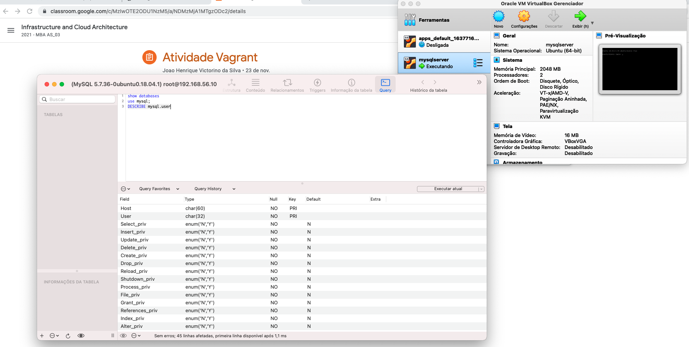
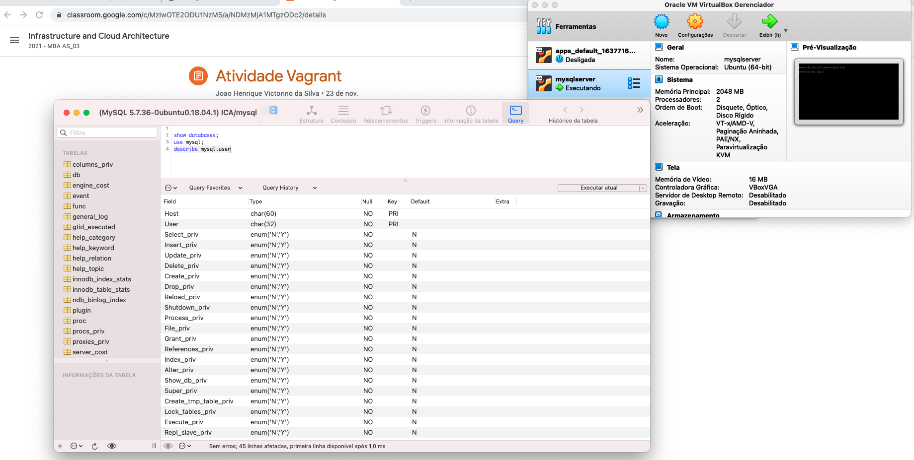

# Infrastructure and Cloud Architecture

## Especifico academico - Introduçao ao Vagrant - MBA AS_03

### Equipe C - "Katie Bouman"
#### Membros que componhem esse trabalho:

- Francisco Edson A Nascimento
- Beatriz Maciel Costa
- Janilson Dias de Oliveira
- Michael Douglas B. Silva
- Roberto Pires de Oliveira
- 

###### Para rodar este projeto devera ter os seguintes items:

- Vagrant - [Ver documentação](https://www.vagrantup.com/intro)
- VirtualBox - [Download](https://www.virtualbox.org/)

###### Quando estiver tudo instalado e configurado

###### Fazer o clone desse repositorio e rodar o comando

`vagrant up`  - Ira construir a VM no virtualbox e configurar

#####  Comandos Basicos do vagrant:
```
`vagrant init`    --  Cria o arquivo principal Vagrantfile
`vagrant up`      --  Cria e inicia a VM
`vagrant status`  --  Exibe o status da VM
`vagrant ssh`     --  Conectar na VM via ssh
`vagrant halt`    --  Desliga a VM
`vagrant destroy` --  Apaga/Deleta a VM e todos os arquivos da VM
`vagrant provision` --  Rodar o provision (ex: scripts externos, ou interno, etc..)
`vagrant box list` --  Exibe uma lista de boxes

```
### Evidência 001 - User root Private IP - SGBD - Squel Ace



### Evidência 002 - User root localhost - SGBD - Squel Ace



##### Qualquer duvida me comunicar via email d19sp.developer@gmail.com
